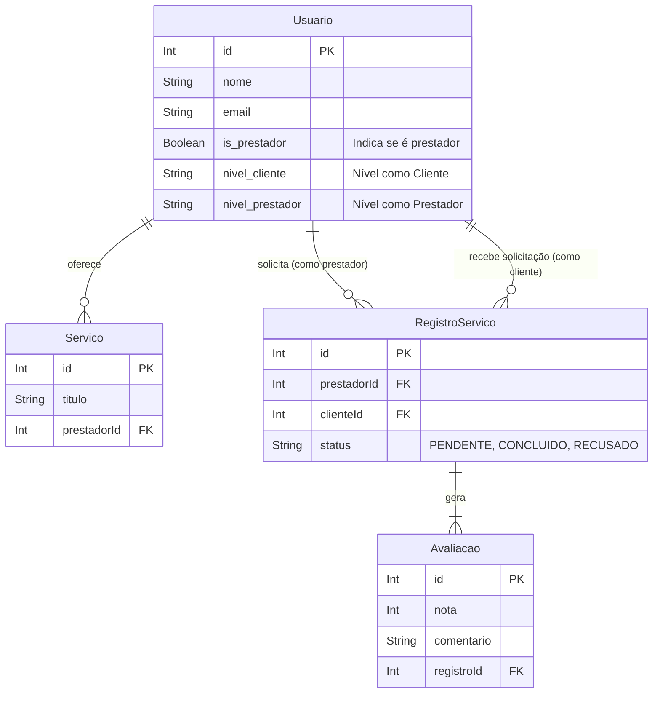
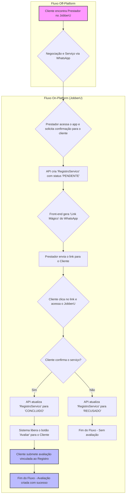

# Histórico de Reuniões - Projeto JobberU

Este documento serve como um registro das decisões de arquitetura e planejamento de produto para a API do JobberU, detalhando a análise de requisitos e as soluções de design adotadas.

---

## Reunião de Arquitetura e Produto - 27/05/2024

### Participantes

- **Washington Lemos** - Product Owner / Lead Developer
- **Gemini Code Assist** - Consultor Técnico

### Pauta da Reunião

1.  Analisar as limitações e vulnerabilidades do sistema atual de papéis de usuário (`CLIENTE` vs. `PRESTADOR`).
2.  Projetar uma arquitetura de papéis flexível, que permita a um usuário ser tanto cliente quanto prestador.
3.  Desenvolver um mecanismo de segurança para mitigar fraudes de autoavaliação.
4.  Definir um plano de ação técnico para a implementação da nova arquitetura.

---

### 1. Análise dos Problemas Centrais

Após análise dos requisitos de negócio e da arquitetura inicial, identifiquei dois problemas críticos que poderiam impedir o crescimento e a confiabilidade da plataforma:

- **Problema A: Rigidez dos Papéis de Usuário**

  - **Situação:** Um usuário é definido como `CLIENTE` ou `PRESTADOR` no momento do cadastro, usando um campo `enum tipo`. Essa decisão é permanente.
  - **Impacto:** Um prestador de serviços não pode contratar outro prestador usando a mesma conta, forçando a criação de um segundo perfil com outro e-mail. Isso gera uma péssima experiência de usuário e fragmenta a identidade na plataforma.

- **Problema B: Vulnerabilidade de Segurança (Fraude de Autoavaliação)**
  - **Situação:** Qualquer pessoa pode criar contas de `CLIENTE` livremente e avaliar qualquer `PRESTADOR`.
  - **Impacto:** Um prestador mal-intencionado pode criar múltiplas contas de cliente falsas para se autoavaliar, inflando sua nota artificialmente. Isso destrói a confiança, que é o principal ativo de um marketplace de serviços.

**Conclusão da Análise:** A raiz de ambos os problemas reside no sistema de papéis simplista. A arquitetura a ser projetada precisa endereçar tanto a flexibilidade quanto a segurança de forma integrada.

---

### 2. Brainstorming e Evolução das Soluções

Foram levantadas várias abordagens para análise, evoluindo de uma solução simples para uma mais robusta e alinhada com a visão de longo prazo do produto.

#### **Decisão Estratégica: Adotar o Fluxo Híbrido de "Confirmação de Serviço"**

Após avaliar as alternativas, decidi por uma arquitetura híbrida que equilibra a simplicidade do MVP com a segurança necessária para a escalabilidade.

- **Conceito:** A avaliação de um serviço não é mais uma ação livre, mas uma consequência de um "aperto de mão digital" que confirma a realização de um serviço. Isso é feito sem forçar um sistema de contrato interno, respeitando a estratégia de negociação externa (via WhatsApp) do MVP.

- **Fluxo de Confirmação:**
  1.  **Negociação Externa:** Cliente e Prestador negociam e realizam o serviço fora da plataforma.
  2.  **Iniciativa do Prestador (On-platform):** Após o serviço, o prestador (maior interessado na avaliação) entra no JobberU e solicita a confirmação do serviço para aquele cliente. A API cria uma entidade `RegistroServico` com status `PENDENTE_CONFIRMACAO_CLIENTE`.
  3.  **Notificação ao Cliente (Canal Otimizado):** A notificação ao cliente será feita via WhatsApp, utilizando um "Link Mágico" gerado pelo front-end. Isso torna o processo pessoal, imediato e sem custo de API, alinhado ao comportamento do usuário-alvo.
  4.  **Confirmação do Cliente (On-platform):** O cliente clica no link, acessa a plataforma e confirma a realização do serviço. A API atualiza o status do `RegistroServico` para `CONCLUIDO`.
  5.  **Liberação da Avaliação:** **Somente após a confirmação**, o sistema permite que o cliente avalie o prestador referente àquele serviço específico, vinculando a avaliação ao `RegistroServico`.

---

### 3. Ideias Adicionais e Refinamentos

A partir da solução principal, foram derivados os seguintes refinamentos para enriquecer a experiência do usuário e fortalecer o ecossistema da plataforma:

- **Identidade Dupla e Selos de Nível (Gamificação):**

  - **Ideia:** Em vez de um único selo, o usuário terá dois níveis separados: `nivel_cliente` e `nivel_prestador` (ex: Bronze, Prata, Ouro).
  - **Jornada:** Um usuário começa como "Cliente Bronze". Ao se tornar prestador, ele passa a ter dois selos: "Cliente Bronze" e "Prestador Bronze". Sua reputação em cada papel evolui de forma independente, baseada no número de serviços concluídos.
  - **Impacto:** Cria um sistema de reputação robusto, incentiva o bom comportamento e o engajamento, e valoriza toda a jornada do usuário na plataforma.

- **Selo Visual de "Prestador":**
  - **Ideia:** Utilizar o campo `is_prestador: true` para exibir um selo de verificação ou um ícone especial ao lado do nome de um usuário em todo o site, comunicando visualmente seu status de prestador de serviços.

---

### 4. Diagramas da Arquitetura Proposta

Para visualizar a solução, foram criados os seguintes diagramas:

#### Diagrama de Entidade-Relacionamento (ERD)

O diagrama abaixo ilustra a nova estrutura do banco de dados, com a introdução da entidade `RegistroServico` e a refatoração do `Usuario`.

#### Fluxograma da Aplicação: Processo de Avaliação Segura

Este fluxograma detalha o passo a passo do processo de "Confirmação de Serviço", que é o coração do novo mecanismo de segurança.

---

### 5. Conclusão e Plano de Ação Técnico

A arquitetura definida é clara, segura, escalável e alinhada com a estratégia de produto do MVP. O plano de ação para a implementação no back-end é o seguinte:

1.  **Refatorar `schema.prisma`:**

    - Remover o `enum UserRole` e o campo `tipo`.
    - Adicionar `is_prestador: Boolean @default(false)`.
    - Adicionar `nivel_cliente: String @default("Bronze")`.
    - Adicionar `nivel_prestador: String @default("Bronze")`.
    - Criar o modelo `RegistroServico` conforme o ERD.

2.  **Ajustar Controllers Existentes:**

    - Modificar `usuario.controller.js` e `servico.controller.js` para usar a verificação `is_prestador` em vez de `tipo`.

3.  **Criar Módulo `RegistroServico`:**

    - Desenvolver as rotas e controllers para gerenciar o ciclo de vida da confirmação (`solicitar`, `confirmar`, `recusar`).

4.  **Refatorar Módulo `Avaliacao`:**
    - Alterar a rota de criação de avaliação para que ela dependa de um `registroId` com status `CONCLUIDO`, garantindo a segurança do processo.

**Status:** Design da solução concluído. Próximo passo é iniciar a implementação do back-end.
